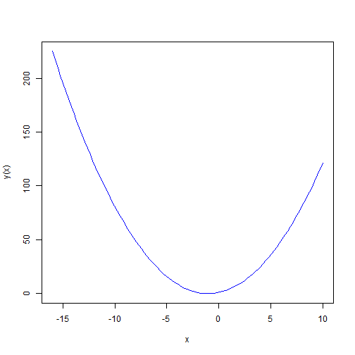

## Factoring by inspection

In elementary algebra, a quadratic equation (from the Latin quadratus for "square") is any equation having the form

$$ax^2+bx+c=0$$

where `x` represents an unknown, and `a`, `b`, and `c` are constants with a not equal to 0. If `a = 0`, then the equation is linear, not quadratic. The parameters `a`, `b`, and `c` are called, respectively, the quadratic coefficient, the linear coefficient and the constant or free term.

In the quadratic formula, the expression underneath the square root sign is called the discriminant of the quadratic equation, and is often represented using an upper case D or an upper case Greek delta:
$$D=b^2-4ac$$

A quadratic equation with real coefficients can have either one or two distinct real roots, or two distinct complex roots. In this case the discriminant determines the number and nature of the roots.

--- .class #id 

## Discriminant. Case 1
If the discriminant is positive, then there are two distinct roots:
$$x_{1,2}=\frac{-b\pm\sqrt[]{D}}{2a}$$
 

--- .class #id 

## Discriminant. Case 2

If the discriminant is zero, then there is exactly one real root:
$$x=\frac{-b}{2a}$$

 

--- .class #id 

## Discriminant. Case 3

If the discriminant is negative, then there are no real roots.

 
